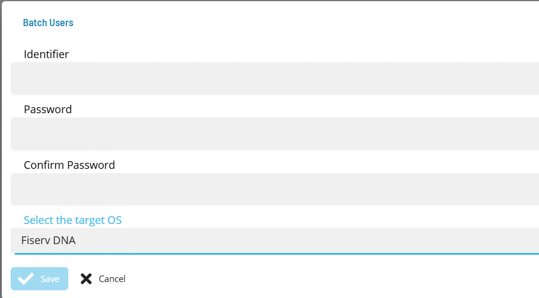

# Define FiservDNA Batch Users

**Theme:** Configure | **Audience:** System Administrator

## What is it?

The ACS FiservDNA integration requires OpCon batch users to supply credentials for network drive mappings, the SQT program, and the Oracle database. These users are created once and then selected by name when configuring the agent connection.

The following batch users are required:
- Each user associated with a Network Drive Mapping.
- The SQT user.
- The Oracle User.

## Define a batch user

To define FiservDNA batch users, complete the following steps:

1.  Open Solution Manager.
2.  From the Home page select **Library**.
3.  From the **Security** menu select **Batch Users**.
4.  Select **+Add** to add a new Batch User.
5.  Select **Fiserv DNA** from the **Select the target OS** list.
6.  Enter the User name that will be used to create the token in the **Identifier** field.
7.  Enter the password of the defined API User in the **Password** and **Confirm** fields.
8.  Select **Save**.

Repeat for each required batch user.
