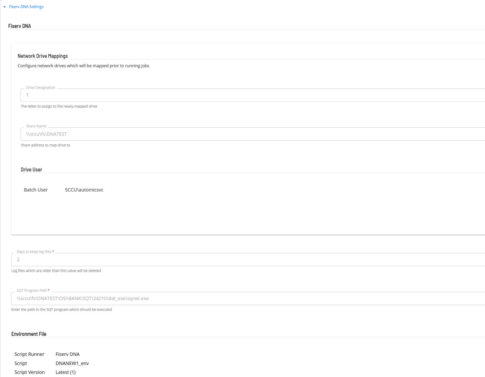
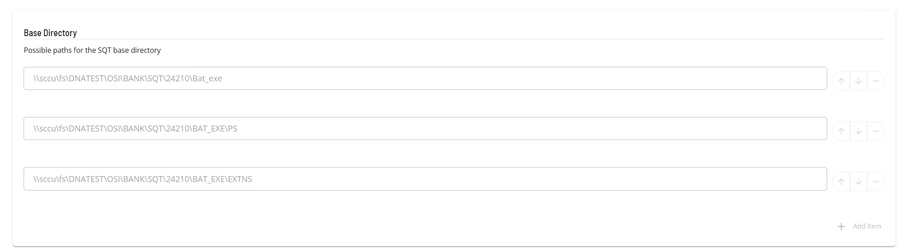
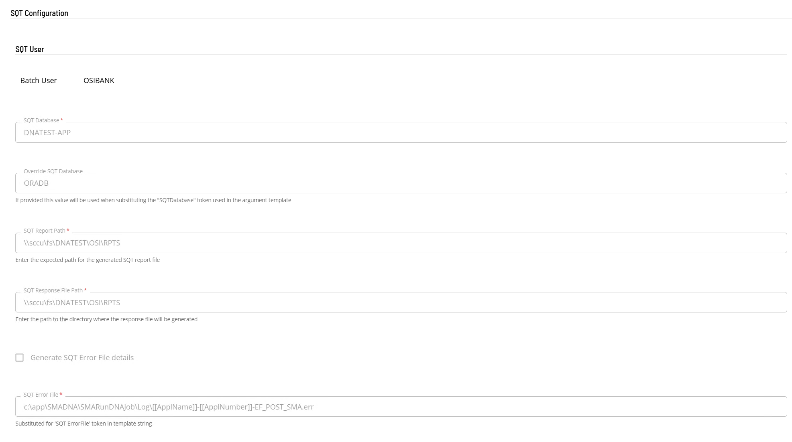
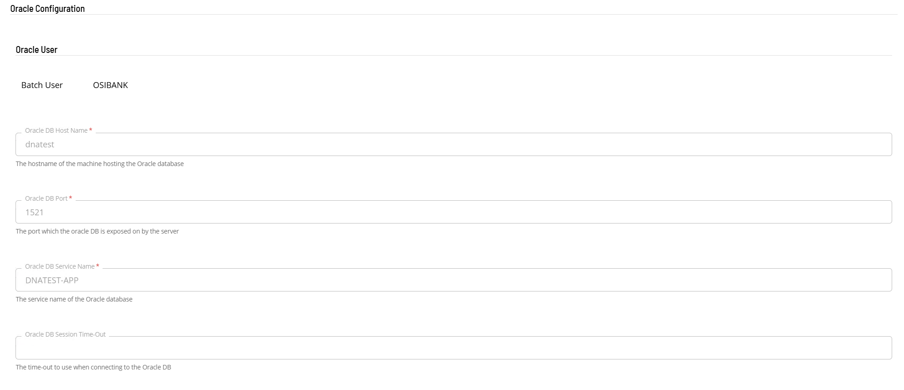
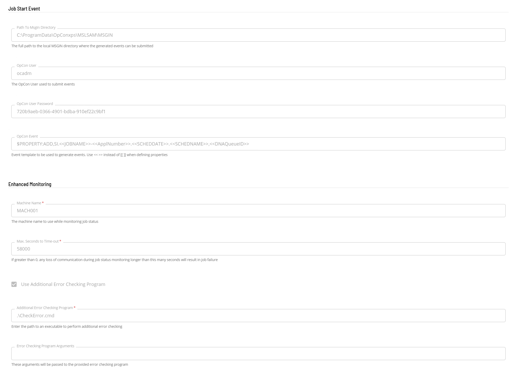
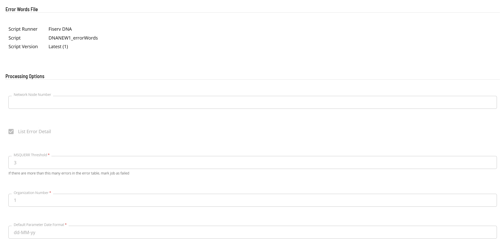
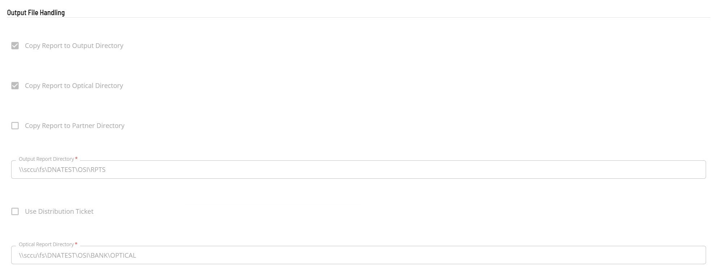

# Define the ACS FiservDNA Agent Connection

**Theme:** Configure | **Audience:** System Administrator, Automation Engineer

## Prerequisites

Before defining the agent connection, complete the following:
- [Define FiservDNA Batch Users](./agent-batch-users.md)
- [Define FiservDNA Scripts](./agent-scripts.md)

## Open the agent definition form

The agent definition defines the information included in the generated **SMARunJobDNA.ini** file. Items highlighted in red are required. Global properties are supported.

To open the agent definition form, complete the following steps:

1.  Open Solution Manager.
2.  From the Home page select **Library**.
3.  From the **Administration** menu select **Agents**.
4.  Select **+Add** to add a new agent definition.
5.  Insert a unique name for the connection.
6.  Select **Fiserv DNA** from the **Type** list.
7.  Select **General Settings**. Check that the NetCom Name is set to **Default** or the SMA Relay name if Relay is being used.
8.  Select **Fiserv DNA Settings** and complete the sections below.

## Fiserv DNA Settings

### Network Drive Mappings

1.  In the **Drive Designation** field enter the letter assigned to the mapped drive.
2.  In the **Share Name** field enter the address of the drive mapping.
3.  In the **Drive User** field select the batch user to be used for the drive mapping.

### Program and File Settings

1.  In the **Days to Keep Log files** field enter the value indicating how long log files should be retained.
2.  In the **SQT Program Path** field enter the path to the SQT program which should be executed.
3.  In the **Environment File** section select the script containing the environment information.
4.  In the **Base Directory** section enter the possible paths for SQT base directory. Use the **+ AddItem** button to add values.

### SQT Configuration

1.  In the **SQT User** field select the batch user to be used for SQT.
2.  In the **SQT Database** field enter the SQT database name.
3.  In the **Override SQT Database** field enter the override SQT database name.
4.  In the **SQT Report Path** field enter the expected directory for the generated SQT report file.
5.  In the **SQT Response File Path** field enter the path to the directory where the response file will be generated.
6.  If required, select **Generate SQT Error File details**.
7.  In the **SQT Error File** field enter the template string.

### Oracle Configuration

1.  In the **Oracle User** field select the batch user to be used for the Oracle configuration.
2.  In the **Oracle DB Port** field enter the port on which the Oracle database is exposed.
3.  In the **Oracle DB Service Name** field enter the service name of the Oracle database.
4.  In the **Oracle DB Session Time-Out** field enter a time out value to use when connecting to the Oracle database.

### Job Start Event

1.  In the **Path To Msgin Directory** field enter the path to the msgin directory of the associated Windows Agent.
2.  In the **OpCon User** field enter the OpCon user that will be used to submit the event.
3.  In the **OpCon User Password** field enter the external token of the OpCon user that will be used to submit the event.
4.  In the **OpCon Event** field enter the event template to be used. If OpCon properties are defined in the template definition use `<< >>` pairs instead of `[[ ]]`.

### Enhanced Monitoring

1.  In the **Machine Name** field enter the name of the machine to use while monitoring.
2.  In the **Max seconds to Time-out** field enter the timeout value.
3.  If required, select **Use Additional Error Checking Program**.
4.  In the **Additional Error Checking Program** field enter the path to an executable to perform the additional error checking.
5.  In the **Error Checking Program Arguments** field enter arguments that will be passed to the error checking program.

### Error Words File

In the **Error Words File** section select the script containing the error words file information.

### Processing Options

1.  In the **Network Node Number** field enter the node number.
2.  If required, select **List Error Detail**.
3.  In the **MSQUERR Threshold** field enter the number of errors in the error table to mark a job as failed.
4.  In the **Organization Number** field enter the organization number.
5.  In the **Default Parameter Date Format** field enter the default date definition.

### Output File Handling

1.  If required, select **Copy Report to Output Directory**.
2.  If required, select **Copy Report to Optical Directory**.
3.  If required, select **Copy Report to Partner Directory**.
4.  In the **Output Report Directory** field enter the directory information.
5.  If required, select **Use Distribution Ticket**.
6.  In the **Optical Report Directory** field enter the directory information.

## Save and activate

1.  Select **Save** to save the definition changes.
2.  Select the **Change Communication Status** button and select **Enable Full Comm** to start the connection.
