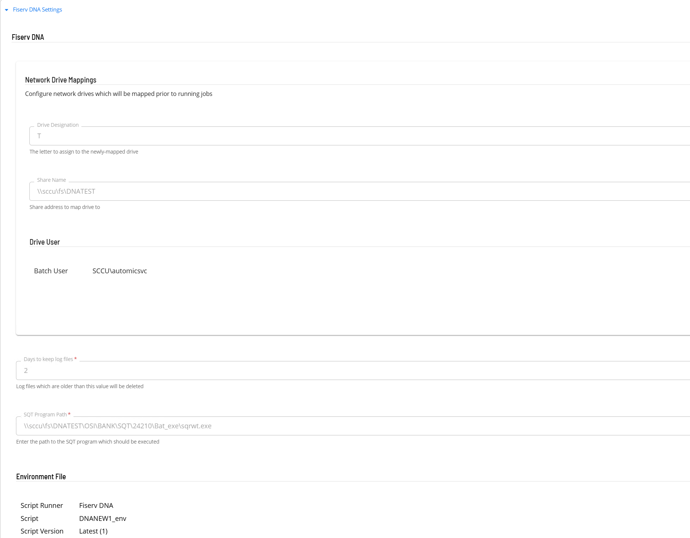
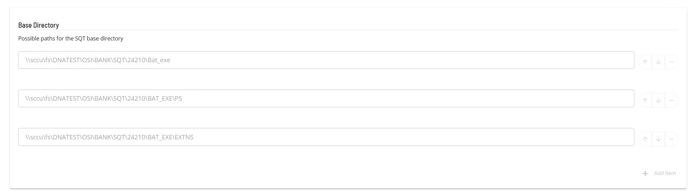
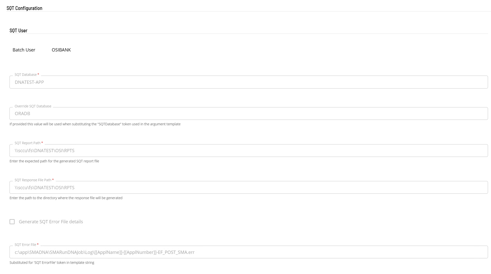
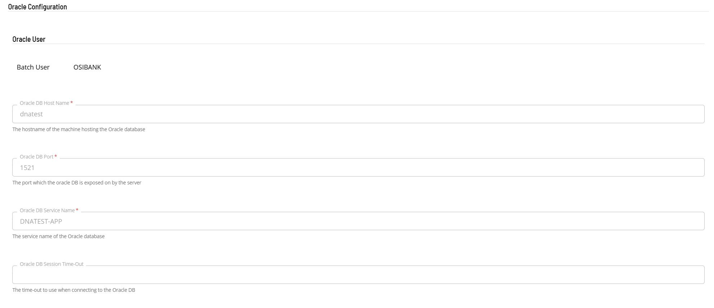
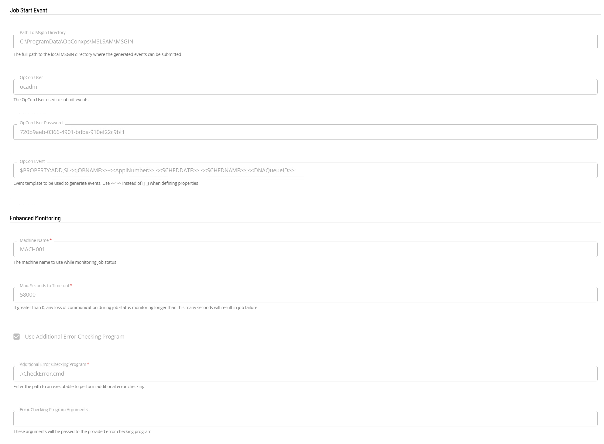
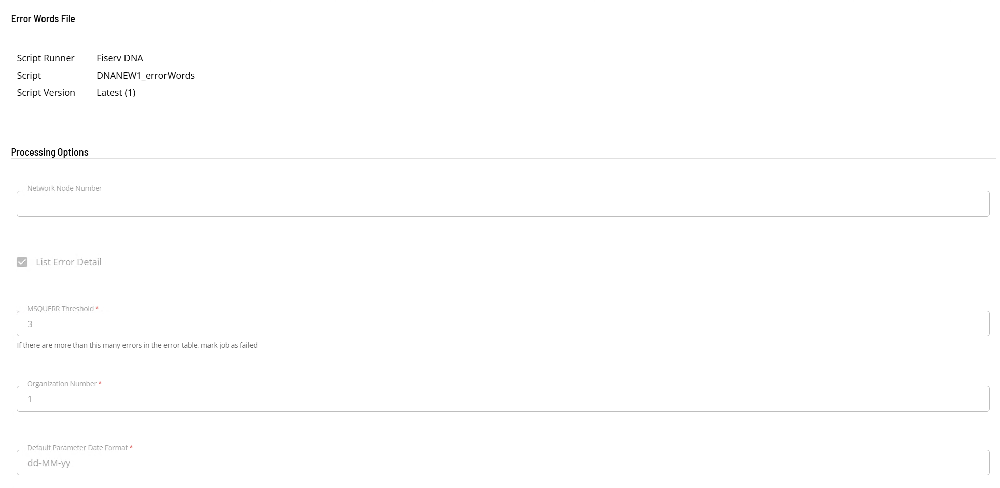
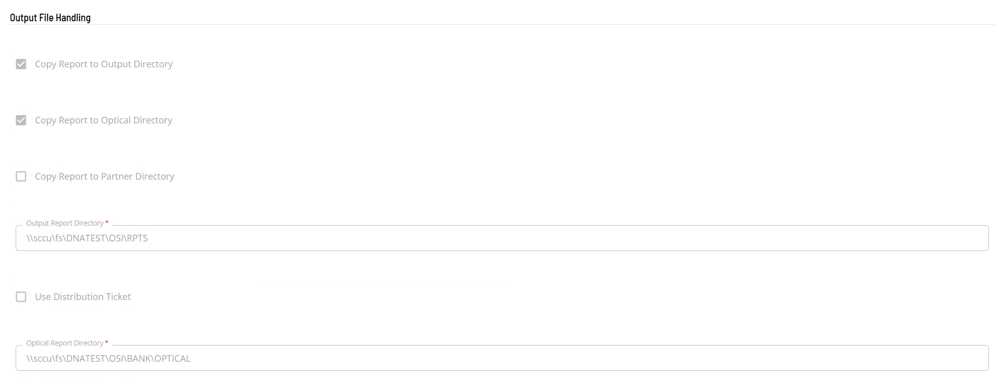

# Define the ACS FiservDNA Agent Connection

**Theme:** Configure | **Audience:** System Administrator, Automation Engineer

## Prerequisites

Before defining the agent connection, complete the following:
- [Define FiservDNA Batch Users](./agent-batch-users.md)
- [Define FiservDNA Scripts](./agent-scripts.md)

## Open the agent definition form

The agent definition defines the information included in the generated **SMARunDNAJob.ini** file. Items highlighted in red are required. Global properties are supported.

Some fields appear only after you select the option they depend on. The sections below name the option for each of these fields.















To open the agent definition form, complete the following steps:

1.  Open Solution Manager.
2.  From the Home page select **Library**.
3.  From the **Administration** menu select **Agents**.
4.  Select **+Add** to add a new agent definition.
5.  Enter a unique name for the connection.
6.  Select **Fiserv DNA** from the **Type** list.
7.  Select **General Settings** and check the **NetCom Name**:
    - **Default** for the OpCon server's SMANetCom.
    - The name of the remote SMANetCom, for on-premises sites that run a remote SMANetCom on the Fiserv batch server. See [Install Remote SMANetCom on Fiserv Batch Server](./installation.md#install-remote-smanetcom-on-fiserv-batch-server).
    - The SMA Relay name, if Relay is used.
8.  Select **Fiserv DNA Settings** and complete the sections below.

## Fiserv DNA Settings

### Network Drive Mappings

Network drives are mapped before each job runs. You can add up to 100 drive mappings.

1.  In the **Drive Designation** field enter the letter assigned to the mapped drive (one character).
2.  In the **Share Name** field enter the address of the drive mapping.
3.  In the **Drive User** field select the batch user to be used for the drive mapping.

### Program and File Settings

1.  In the **Days to keep log files** field enter the number of days to keep log files. Log files older than this value are deleted. The default is 3 and the minimum is 1.
2.  In the **SQT Program Path** field enter the path to the SQT program to run.
3.  In the **Environment File** section select the script containing the environment information.
4.  In the **Base Directory** section enter the possible paths for the SQT base directory. Use the **+ Add Item** button to add values, up to 99.

### SQT Configuration

1.  In the **SQT User** field select the batch user to be used for SQT.
2.  In the **SQT Database** field enter the SQT database name.
3.  In the **Override SQT Database** field enter the override SQT database name. If provided, this value replaces the SQT database name in the SQT argument template.
4.  In the **SQT Report Path** field enter the expected directory for the generated SQT report file.
5.  In the **SQT Response File Path** field enter the path to the directory where the response file is generated.
6.  To have the connector generate the SQT error file value, select **Generate SQT Error File details**.
7.  If **Generate SQT Error File details** is cleared, enter the template string in the **SQT Error File** field. This field appears, and is required, only while the option is cleared.

### Oracle Configuration

1.  In the **Oracle User** field select the batch user to be used for the Oracle configuration.
2.  In the **Oracle DB Host Name** field enter the host name of the machine hosting the Oracle database.
3.  In the **Oracle DB Port** field enter the port on which the Oracle database is exposed.
4.  In the **Oracle DB Service Name** field enter the service name of the Oracle database.
5.  In the **Oracle DB Session Time-Out** field enter a time-out value to use when connecting to the Oracle database.

### Job Start Event

:::caution
For each job run, the connector writes the SQT user's password and the **OpCon User Password** value in plain text to files that Solution Manager lists as the job's output. Anyone who can view the job output can read them. Restrict who can view the output of Fiserv DNA jobs, and use a dedicated OpCon user for the Job Start Event. The **OpCon User Password** value is also shown in plain text on the agent definition form.
:::

1.  In the **Path To MsgIn Directory** field enter the full path to the MSGIN directory of the associated Windows Agent.
2.  In the **OpCon User** field enter the OpCon user that submits the event.
3.  In the **OpCon User Password** field enter the external token of the OpCon user that submits the event.
4.  In the **OpCon Event** field enter the event template to use. If OpCon properties are defined in the template definition, use `<< >>` pairs instead of `[[ ]]`. The default template is:

    ```
    $PROPERTY:ADD,SI.<<JOBNAME>>-<<ApplNumber>>.<<SCHEDDATE>>.<<SCHEDNAME>>,<<DNAQueueID>>
    ```

### Enhanced Monitoring

1.  In the **Machine Name** field enter the name of the machine to use while monitoring job status.
2.  In the **Max. Seconds to Time-out** field enter the number of seconds. If the value is greater than 0, a loss of communication during job status monitoring that lasts longer than this many seconds fails the job. The default is 0, which sets no limit. A job's own **Max. Seconds to Time-out** replaces this value. See [Task Definition](./task-definition.md).
3.  If required, select **Use Additional Error Checking Program**. The next two fields appear only after you select this option.
4.  In the **Additional Error Checking Program** field enter the path to an executable to perform the additional error checking.
5.  In the **Error Checking Program Arguments** field enter arguments to pass to the error checking program.

### Error Words File

In the **Error Words File** section select the script containing the error words file information. This setting is optional.

### Processing Options

1.  In the **Network Node Number** field enter the node number.
2.  If required, select **List Error Detail** to log additional errors found while processing the error table.
3.  In the **MSQUERR Threshold** field enter the threshold. If the error table contains more errors than this value, the job is marked as failed. The default is 0.
4.  In the **Organization Number** field enter the organization number.
5.  In the **Default Parameter Date Format** field enter the default date definition.

### Output File Handling

**Copy Report to Output Directory** is selected by default. The directory fields appear only after you select the option they belong to.

1.  To copy the report to an output directory:
    1.  Select **Copy Report to Output Directory**.
    2.  In the **Output Report Directory** field enter the directory information.
2.  To copy the report to an optical directory:
    1.  Select **Copy Report to Optical Directory**.
    2.  In the **Optical Report Directory** field enter the directory information.
3.  To copy the report to partner directories:
    1.  Select **Copy Report to Partner Directory**.
    2.  In the **Partner Report Directories** section enter at least one **Partner Directory**. Use the **+ Add Item** button to add values.
4.  To use a distribution ticket, select **Use Distribution Ticket**. This option appears when **Copy Report to Output Directory** is selected. Complete the following fields:
    - **Distribution Ticket Directory**: the directory information.
    - **Distribution Schedule**: the name of the schedule that the distribution job is added to.
    - **Distribution Job**: the name of the distribution job.
    - **Distribution Frequency**: the frequency assigned to the distribution job.

## Save and activate

To save and activate the agent connection, complete the following steps:

1.  Select **Save** to save the definition changes.
2.  Select the **Change Communication Status** button and select **Enable Full Comm** to start the connection.
