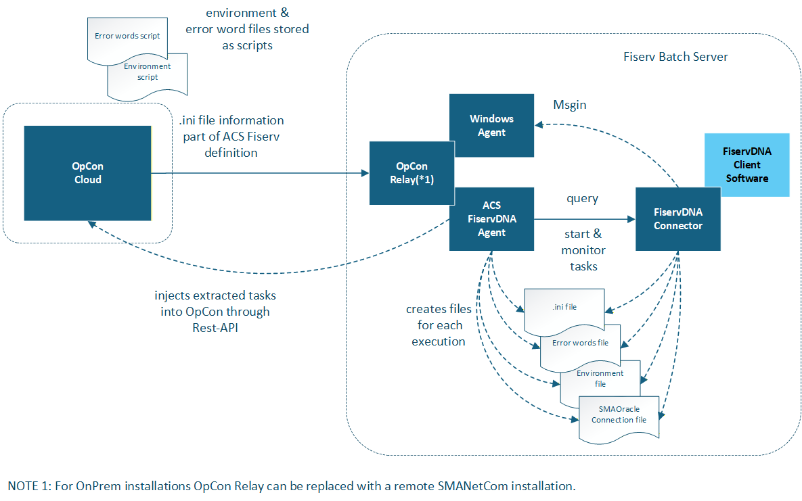

# ACS FiservDNA Connector

**Theme:** Overview | **Audience:** System Administrator, Automation Engineer

## What is it?

Financial institutions use Fiserv DNA for core processing to help attract and retain account holders, reduce expenses, and boost ROI.

OpCon provides a solid integration with Fiserv DNA processing with multiple features:

- Fiserv DNA job-type
- SMARunDNAJob program
- Convert DNA Template program

Use ACS FiservDNA when you want to:
- Centralise all Fiserv DNA connector configuration within OpCon, eliminating the need to edit configuration files on the remote server.
- Query Fiserv DNA environments to automatically import and save task definitions as OpCon jobs.

ACS FiservDNA allows the definition and execution of FiservDNA tasks using Solution Manager.
It is part of the ACS (Agentless Connector System) suite of products.

ACS is a new OpCon Agent type that provides a framework for agent development. It is an internal component provided by the SMANetCom module. All integrations are generated DLLs and placed in a standard folder that is monitored by the ACS services.

These modules are loaded into the OpCon environment during startup. New modules can be copied to the monitored folders and will be available for configuration after the SMA Relay or SMA OpCon Service Manager and SMA OpCon RestAPI services are restarted.

All code and task / agent screen definitions are contained in the generated DLL that is placed in the monitored folder. To display the task and agent definitions, the form layouts are retrieved from the DLL and passed to Solution Manager to render the screen layout. Agent / task definitions are stored as JSON values in the OpCon database tables.

Agent / task definitions for the ACS environment can only be created / updated using Solution Manager.
JORS support for the ACS environment is only provided through Solution Manager.

The ACS FiservDNA implementation serves as a wrapper for the SMARunDNAJob program. All definitions are now located within the OpCon environment and the required files are created for each execution. This means that there is no longer any requirement to edit configuration files on the remote server.
- environment file is stored as a script in the OpCon repository.
- Error word file is stored as a script in the OpCon repository.
- .ini file definitions are included in the ACS Fiserv DNA Agent.

ACS FiservDNA supports the ability to query tasks on the Fiserv DNA environment and then save the returned information as OpCon tasks.

The ACS Fiserv DNA agent does not support the MSGIN functionality, meaning a standard Windows agent should be installed alongside the ACS Fiserv DNA agent to provide msgin capabilities to receive events generated by the FiservDNA Connector.

## FAQs

**What does ACS stand for?**
ACS stands for Agentless Connector System. It is a framework for OpCon agent development provided as an internal component of the SMANetCom module.

**Do I still need a Windows agent alongside the ACS FiservDNA agent?**
Yes. The ACS Fiserv DNA agent does not support the MSGIN functionality. A standard Windows agent must be installed alongside it to receive events generated by the FiservDNA Connector.

**Can I edit configuration files directly on the remote Fiserv DNA server?**
No. All definitions are now located within the OpCon environment. There is no longer any requirement to edit configuration files on the remote server.

## Glossary

**ACS (Agentless Connector System)** — An OpCon agent type that provides a framework for connector development. Integrations are generated as modules and loaded into OpCon at startup from a monitored folder.

**SMARunDNAJob** — The program invoked by the ACS FiservDNA connector to run Fiserv DNA batch jobs.
